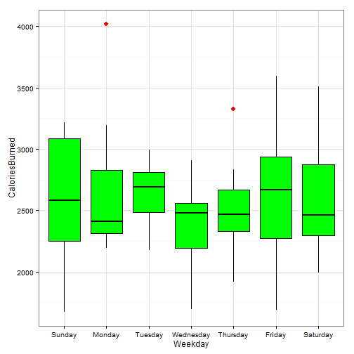

Fitbit Predict Steps: Shiny application
========================================================
author: Gert De Geyter
date: 23th of August 2015

Overview
========================================================

The Shiny app contains three major tabs

- Data exploration: shows different visualisations of the data
- Data exploration: use user input to predict the amount of steps
- About: documentation about the code

Slide With Code
========================================================


```r
library(ggplot2)
library(randomForest)

file <- paste(getwd(),"/data/activities.csv", sep="")
activities <- read.csv(file, sep=";", dec = ",")
activities$Date <- as.POSIXlt(strptime(activities$Date,"%d/%m/%Y"))
days <- c("Sunday", "Monday", "Tuesday", "Wednesday", "Thursday", "Friday", "Saturday")
activities$Weekday <- days[as.POSIXlt(activities$Date)$wday + 1]
activities$Weekday <- factor(activities$Weekday, levels = days)
```

Example of data exploration
========================================================

 

Slide with code to make predictions
========================================================


```r
tmp <- activities[, -which(names(activities) %in% c("Date","Weekday"))]
fit <- randomForest(Steps ~ ., data=tmp, ntree=200)
means <- as.data.frame(t(colMeans(tmp)))
prednames <- names(activities)
prednames <- prednames[-which(prednames %in% c("Date","Weekday"))]
```


